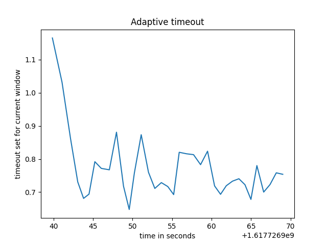
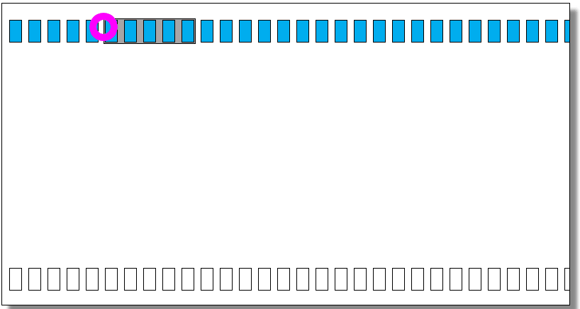

# Reliable-UDP
### The emitter header
````
  0               1               2               3              4
  0 1 2 3 4 5 6 7 0 1 2 3 4 5 6 7 0 1 2 3 4 5 6 7 0 1 2 3 4 5 6 7
 -+-+-+-+-+-+-+-+-+-+-+-+-+-+-+-+-+-+-+-+-+-+-+-+-+-+-+-+-+-+-+-+- -----------------
 |          Source Port          |       Destination Port        |
 -+-+-+-+-+-+-+-+-+-+-+-+-+-+-+-+-+-+-+-+-+-+-+-+-+-+-+-+-+-+-+-+-   UDP header
 |          Length               |          Checksum             |
 -+-+-+-+-+-+-+-+-+-+-+-+-+-+-+-+-+-+-+-+-+-+-+-+-+-+-+-+-+-+-+-+- -----------------
 |                        Sequence Number                        |  
 -+-+-+-+-+-+-+-+-+-+-+-+-+-+-+-+-+-+-+-+-+-+-+-+-+-+-+-+-+-+-+-+-  Header Reliable UDP emitter
 |          Checksum             |S P F|      zeros              |    8 bytes
 -+-+-+-+-+-+-+-+-+-+-+-+-+-+-+-+-+-+-+-+-+-+-+-+-+-+-+-+-+-+-+-+- -----------------
 |                       payload/data                            |  a payload of maximum 1400 bytes
 -+-+-+-+-+-+-+-+-+-+-+-+-+-+-+-+-+-+-+-+-+-+-+-+-+-+-+-+-+-+-+-+- -----------------
````


#### Sequence number
The sequence number is a 4 byte number (unsigned int `!L`) that's part of the added header on UDP from the emitter's side. We chose to set the sequence number as:
- a random number `seq_nr[0]` between `0` and `1 << 16` for the first packet
- `seq_nr[n+1]` = `seq_nr[n] + 1 + length of payload sent through the packet`
To ensure that the sequence number doesn't get bigger than `1<<16` we use modulo `(1<<16 -1)`. We chose `1<<16 -1` and not simply `1<<16` because we save one sequence number for a special `window_0` message.

#### Checksum 
For calculating the checksum, we chose the following algorithm:
````python
def calculeaza_checksum(octeti):
    global max_nr                           # this has value 1<<16
    checksum = 0
    numere = []
    
    if len(octeti) % 2 == 1:                # in case the packet has odd number of octets we add one more 
        octeti += bytes(1)

    for i in range(0, len(octeti), 2):      # we form 16 bit numbers from pairs of consecutive octets
        numar = octeti[i] << 8
        numar += octeti[i+1]
        numere.append(numar)
        
    sum=0
    for numar in numere:
        sum+=numar                          # we add these numbers to a sum
        sum1 = sum % max_nr                 # to deal with large amounts of numbers, we add the carry 
        sum2 = sum//max_nr                  # while adding the numbers
        sum = sum1+sum2
 
    checksum = max_nr - 1 - (sum)           # checksum is one's complement of this sum
    return checksum
````
Verifying this checksum:
````python
def verifica_checksum(octeti):
    global max_nr                           # this has value 1<<16
    sum = 0

    if len(octeti) % 2 == 1:                # in case the packet has odd number of octets we add one more
        octeti += bytes(1)      

    for i in range(0, len(octeti), 2):    
        numar = octeti[i] << 8              # we form 16 bit numbers from pairs of consecutive octets
        numar+=octeti[i+1]
        sum+=numar                          # we add these numbers to a sum
        sum1 = sum % max_nr                 # to deal with large amounts of numbers, we add the carry 
        sum2 = sum//max_nr                  # while adding the numbers
        sum = sum1+sum2
                                            
                                            # by now this sum should be 65535, the largest number on 16 bits
    sum+=1                                  # by adding 1, modulo (1<<16) we should get a 0
    sum = sum % max_nr
    
    if(sum==0):
        return True
    else:
        return False
````
#### Flags
We have 3 types of flags available:
- 'S', encoded as 001, which signals that we want to start a connection
- 'P', encoded as 010, that marks packets of the actual data we want to transmit
- 'F', encoded as 100, which signals that we want to stop the connection

### The receiver header
````
  0               1               2               3              4
  0 1 2 3 4 5 6 7 0 1 2 3 4 5 6 7 0 1 2 3 4 5 6 7 0 1 2 3 4 5 6 7
 -+-+-+-+-+-+-+-+-+-+-+-+-+-+-+-+-+-+-+-+-+-+-+-+-+-+-+-+-+-+-+-+- -----------------
 |          Source Port          |       Destination Port        |
 -+-+-+-+-+-+-+-+-+-+-+-+-+-+-+-+-+-+-+-+-+-+-+-+-+-+-+-+-+-+-+-+-   UDP header
 |          Length               |          Checksum             |
 -+-+-+-+-+-+-+-+-+-+-+-+-+-+-+-+-+-+-+-+-+-+-+-+-+-+-+-+-+-+-+-+- -----------------
 |                    Acknowledgment Number                      |
 -+-+-+-+-+-+-+-+-+-+-+-+-+-+-+-+-+-+-+-+-+-+-+-+-+-+-+-+-+-+-+-+-  Header Reliable UDP receiver
 |             Checksum          |          Window               |    8 bytes
 -+-+-+-+-+-+-+-+-+-+-+-+-+-+-+-+-+-+-+-+-+-+-+-+-+-+-+-+-+-+-+-+- -----------------

````
#### Acknowledgment number
The acknowledgment number is a 4 byte number (unsigned int `!L`). When the receiver receives a package with `seq_nr` it acknowledges it by sending back a package with an acknowledgment number set to `ack_nr = seq_nr + 1`. This is how we know which packages were received and which were not. Because the acknowledgment number depends on the sequence number, it must go through the same modulo operations as the sequence number to ensure that it does not overflow 4 bytes.

#### Window
In a real-world situation, the window would be the receiver's way to tell the emitter how many more packets to send based on the free space in its buffer. We simulate this by sending a random window between `0` and `5` with every packet.

#### Adaptive timeout


We used the adaptive timeout used in TCP:
- `SRTT[n+1] = 0.9*SRTT[n] + 0.1*RTT[n+1]`
- `Svar[n+1] = 0.9*Svar[n] + 0.1 * abs(RTT[n+1] - SRTT[n+1])`
- `timeout[n] = SRTT[n] + 4*Svar[n]`

where:
- `SRTT[n]` is the smooth round trip time for packet `n`
- `Svar[n]` is the smooth variation up until packet `n`

#### Sliding window go-back-n approach

We adapted the above approach of the sliding window algorithm to communicate with the receiver and take into account the window size sent by the receiver. When there's a timeout, we resend a window of size W, where W is the last window we received from the receiver.


When we receive a window size of 0 we stop sending packets and wait for the receiver to send us another window. In order to avoid stalling, the receiver has a special packet that it sends to the emitter after a window 0 packet. This special packet is mapped with the sequence number `1<<16 - 1`, to avoid confusion with an acknowledgment number from an actual packet.
